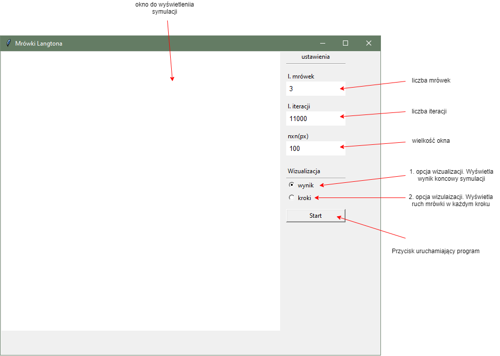
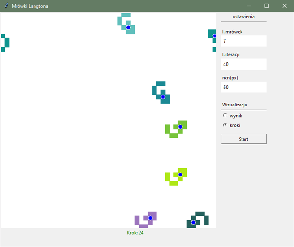
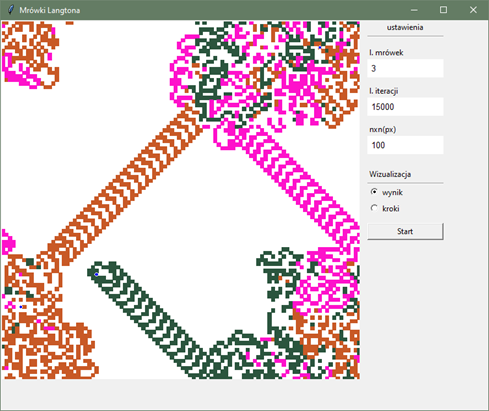

# STUDIA-symulacje-komputerowe
#### Projekt Mrówki Langtona został wykonany w ramach przedmiotu na studiach Symulacje Komputerowe
```
Założenia projektu:
1. Stworzenie symulacji dla n-mrówek poruszających się zadaną liczbę iteracji po planszy
2. Przygotowanie wizualizacji na dwa sposoby
    * wizualziacja ruchu mrówek w postaci krokowej
    * wyswietlenie stanu planszy po zadanej liczbie iteracji - wynik ostateczny.
3. Przygotowanie prostego i łatwego w użyciu interfejscu.
```

## Interface


##Przykładowa symulacja dla 4 mrówek
#### W krokach 



#### Jako wynik końcowy




## Technologie 
* python v 3.7.7

## Biblioteki 
* tkinter 

## Edytor
* PyCharm

## Uruchomienie programu 
nalezy pobrać repozytorium i uruchomic plik ```main.py ```


